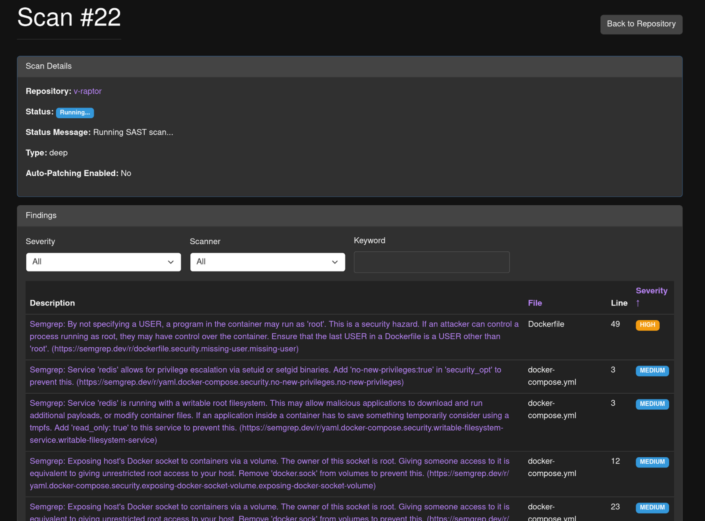

# V-Raptor

V-Raptor is an AI agent for automated code analysis, bug detection, and remediation.

## Features

- **Automated Code Analysis:** Analyzes code for security vulnerabilities, bugs, and code quality problems.
- **Automated Remediation:** Generates patches for detected vulnerabilities and bugs.
- **Manual and Deep Scans:** Perform deep scans of repositories to find hidden vulnerabilities and secrets, or trigger scans manually from the web UI.
- **Dependency and Configuration Scanning:** Scans dependencies for known vulnerabilities and configuration files for security misconfigurations.
- **Webhook Support:** Continuously analyze code by listening for webhook events from your Git provider.
- **Web UI:** A simple web UI to browse scan results, manage repositories, and configure the application.

## Screenshots



## Getting Started

### Prerequisites

- Python 3.10 or later
- Docker
- Go
- Redis

### Tool Dependencies

V-Raptor relies on several external tools for its scanning capabilities. These tools are automatically installed when using the provided `Dockerfile`. If you are running V-R-Raptor without Docker, you will need to install them manually.

-   **SAST & Secret Scanning:**
    -   `semgrep`
    -   `bandit`
    -   `gitleaks`
    -   `brakeman`
    -   `njsscan`
    -   `gosec`
    -   `cppcheck`
-   **Code Quality (Python):**
    -   `pylint`
    -   `cohesion`
    -   `radon`
-   **Code Quality (Ruby):**
    -   `rubycritic`
-   **Code Quality (JavaScript):**
    -   `plato`
-   **Code Quality (Go):**
    -   `gocyclo`
-   **Code Quality (Rust):**
    -   `rust-code-analysis-cli`
-   **Code Quality (C++):**
    -   `lizard`
-   **Code Duplication:**
    -   `pmd` (via a downloaded zip)

### Installation

1. Clone the repository:

```
git clone https://github.com/your-username/v-raptor.git
```

2. Install the dependencies:

```
./run.sh
```

Also initialize the DB:
```
./run.sh --init-db
```

### Running with Docker Compose

V-Raptor can be run with Docker Compose, which will build the Docker image and start the web server, worker, and Redis.

1. Start the application:

```
docker-compose up --build
```

This will build the Docker image, start the containers, and show the logs. To run in the background, use `docker-compose up -d --build`.

2. Open your browser and go to `http://localhost:5000`.

## Usage

V-Raptor can be used in several ways:

### Web UI

The easiest way to use V-Raptor is through the web UI.

1. Start the web server:

```
./run.sh start-web
```

2. Open your browser and go to `http://localhost:5000`.

From the web UI, you can:
- Add and remove repositories.
- Run and re-run scans.
- View scan results and findings.
- Configure the application.

### Command Line

You can also run scans from the command line.

To run a deep scan of a repository:

```
./run.sh --scan-url <repository-url>
```

To scan a specific commit:

```
./run.sh --scan-url <repository-url> --scan-commit <commit-hash>
```

To scan a local repository:

```
./run.sh --scan-local /path/to/your/repo
```

You can also output the findings in JSON format, which is useful for scripting and integrations:

```
./run.sh --scan-local /path/to/your/repo --output-json
```

## Configuration

All configuration is done through the web UI. Go to the "Configuration" page to set up your API keys and other settings.

## Advanced Usage

For more advanced usage, including server mode, git hooks, and webhooks, see the [Advanced Usage](docs/advanced_usage.md) documentation.
